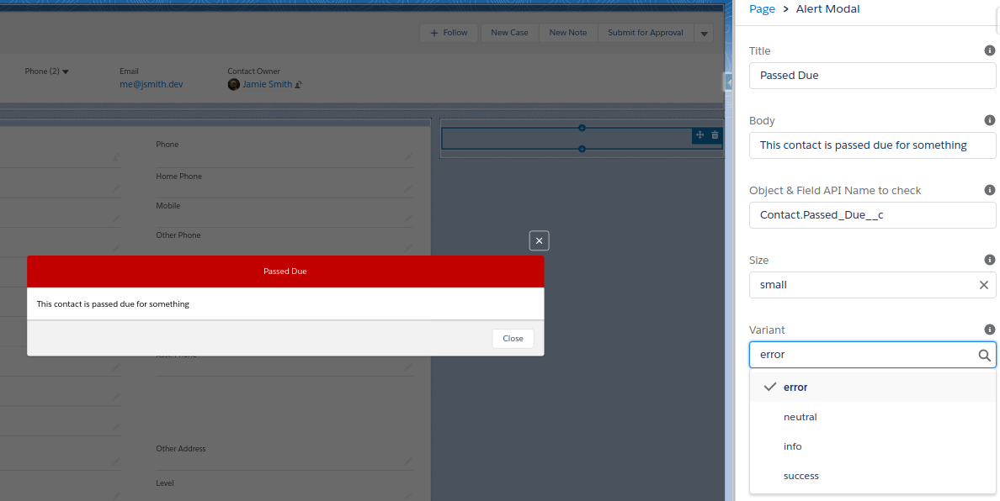

# alert-modal

A modal to alert a user to something utilizing the app builder (LWC)



## Properties

### title

- Title for modal
- String
- defaults to: Default Text

### body

- Text for modal body
- String
- defaults to: Default Text

### field_to_check *

- Object &amp; Field API Name to check
- String
- Object.Field to check if true. Example: User.IsActive on a User record. Can be a checkbox formula

### size

- Size of the modal
- String (small || medium || large)
- Defaults to small

### variant

- Color variant of the header
- String (neutral || info || success || error)
- Defaults to neutral

[*] Required

## Deploy

Covert with SFDX; This creates a folder called `deploy`

```bash
sfdx force:source:convert -r force-app -d deploy
```

Now you can deploy from the resulting `deploy` directory

```bash
sfdx force:mdapi:deploy -d deploy -w -1  --verbose 
```

📌  Above deploys to the default org set

- Add `-u user@domain.com` or `-u alias` to deploy elsewhere
- To run tests add `-l RunSpecifiedTests -r ApexTestName`

Results should more or less mirror below

```bash
Job ID | 0Af1U000016lG6PSAU

MDAPI PROGRESS | ████████████████████████████████████████ | 2/2 Components

                                                         NAME         ID
────────────────────────  ─────────────────────────────  ───────────  ──────────────────
                          deploy/package.xml             package.xml
ApexClass                 deploy/classes/AlertModal.cls  AlertModal   01p1U00000QWjfrQAD
LightningComponentBundle  deploy/lwc/alertModal          alertModal   0Rb1U000000PKxwSAG
```